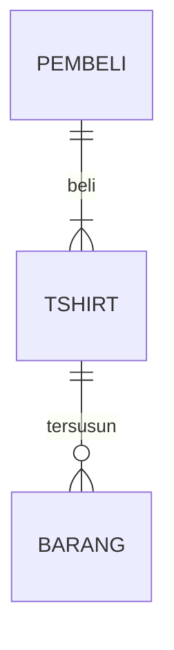
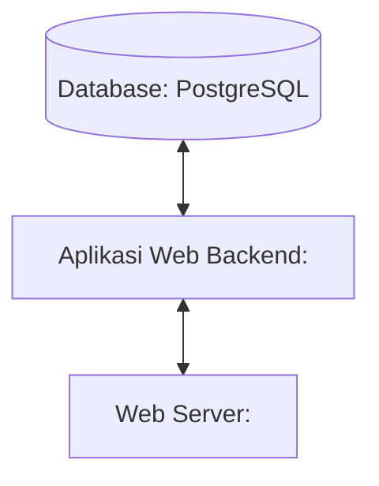

## 1.1 Latar Belakang

Latar belakang pembangunan web e-commerce mencakup pertumbuhan pesat perdagangan elektronik seiring dengan akses internet yang semakin meluas. Web memainkan peran kunci dalam memungkinkan pembuatan toko online, transaksi, dan interaksi pelanggan. E-commerce memberikan keuntungan akses pasar global, biaya operasional yang lebih rendah, dan pelacakan pelanggan yang akurat, tetapi juga menuntut keamanan yang kuat dan pengalaman pengguna yang baik. Persaingan yang semakin ketat mendorong inovasi dalam desain situs web dan strategi bisnis. Pemerintah juga mulai mengatur e-commerce untuk melindungi konsumen, dan teknologi seperti kecerdasan buatan dan IoT akan mempengaruhi masa depan perdagangan elektronik.

## 1.2. Deksripsi Teknologi Informasi

Website secondside ini dibuat untuk menjual barang secara online, di dalamnya terdapat berbagai item fashion yang dijual secara online agar pengguna dapat dengan mudah membeli barang dimanapun dan kapanpun. Bertujuan untuk memudahkan kegiatan jual beli yang disajikan dalam bentuk website.

## 1.3. Branding

Pada tahap ini kita mengeksplorasi branding dari sistem yang dibuat. Branding meliputi:

Merk: secondside / SCND

Tagline: Experience Elegance in Every Stitch

Campaign: Menyediakan website yang memudahkan pengguna dalam menemukan katalog pakaian dan bertransaksi dengan mudah 

TARGER USER :

Usia 15+

Seorang yang senang dengan item fashion

Seorang yang senang dengan clothing brand

Seorang yang tidak ingin ketinggalan seputar update item fashion

USER EXPERIENCE THEME :

Interaktif

Menarik

Minimalis

Inspirasi desain:

## 2. User Story

Pengguna | Saya ingin bisa| Sehingga |Prioritas
---|---|---|---
Pengguna | Melihat katalog | Bisa mengetahui katalog produk| ⭐⭐⭐⭐⭐
Pengguna | Melihat Menu Produk | Bisa mengetahui deskripsi produk| ⭐⭐⭐⭐⭐
Pengguna | Membuat member akun | Bisa mengetahui recent order,manage shipping & billing address| ⭐⭐⭐⭐⭐
Pengguna | Melihat cart | Bisa mengetahui produk yang dimasukkan ke cart| ⭐⭐⭐⭐⭐

## 3. Struktur Data

Cara membuat aneka macam bentuk grafik menggunakan mermaid.js bisa lihat di [https://mermaid.js.org/syntax/entityRelationshipDiagram.html](https://mermaid.js.org/syntax/entityRelationshipDiagram.html) 

## 4. Arsitektur Sistem

## 5. Teknologi, Library, dan Framework

- UI/UX Design : Figma
- Web Server : 
- Text Editor : VS Code
- Browser : Chrome
- Library : 
- Framework : 
- Database : PostgreSQL

## 6. Desain User Experience dan User Interface

## 7. Demonstrasi Video

Link youtube nya

## 8. Bagaimana mesin komputasi dan sistem operasi berperan dalam produk teknologi informasimu ?

Link youtube nya di detik jawaban ini

## 9. Bagaimana algoritma, struktur data, dan bahasa pemrograman berperan dalam produk teknologi informasimu ?

Link youtube nya di detik jawaban ini

## 10. Bagaimana metode pengembangan perangkat lunak / Software Development Life Cycle berperan dalam produk teknologi informasimu ?

Link youtube nya di detik jawaban ini

## 11. Bagaimana database / sistem basis data berperan dalam produk teknologi informasimu ?

Link youtube nya di detik jawaban ini
